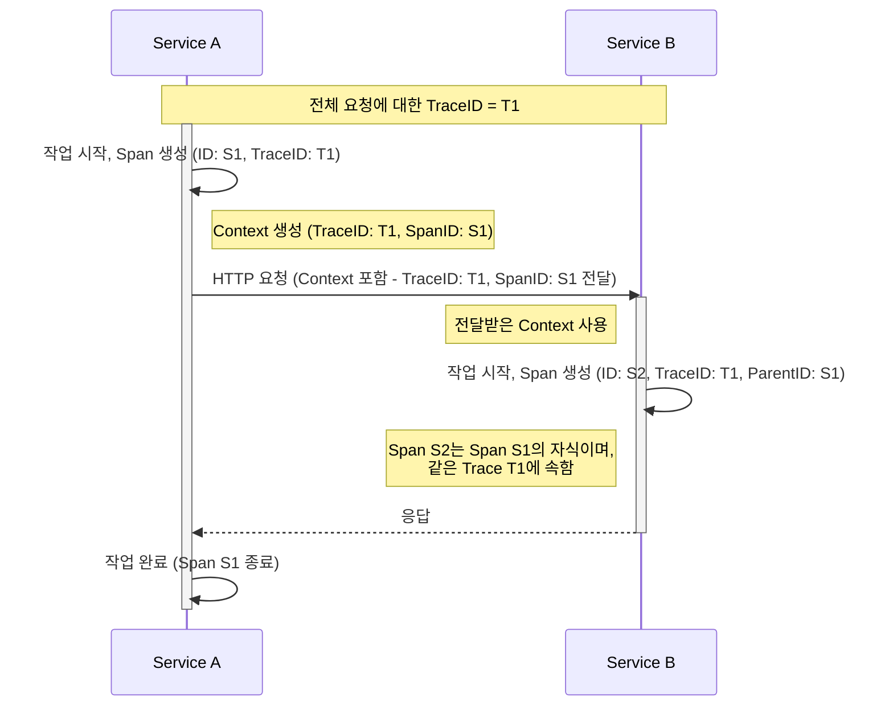

## Context propagation

Context propagation을 통해 signal(trace, metric, log, baggage)이 생성된 위치와 관계없이 signal이 상호 연관될 수 있습니다. context propagation을 통해 분산된 서비스 전반에 걸쳐 시스템에 대한 causal information(인과 관계 정보)를 구축할 수 있습니다.

### Context

Context는 정보를 담고 있는 객체입니다. 이 정보는 송신 서비스와 수신 서비스, 또는 실행 단위가 서로 다른 signal을 연관시키기 위해 사용됩니다. 분산된 시스템 환경에서 하나의 요청이 여러 단계를 거칠 때, 각 단계에서 생성된 signal이 동일한 요청에 속한다는 것을 식별하는 데 사용됩니다. 말 그대로 하나의 맥락을 만들기 위한 객체입니다.

예를 들어 서비스 A가 서비스 B를 호출한다고 해봅시다. 서비스 A에서 만들어진 span은 서비스 B에서 만들어진 span의 parent span으로 사용될 것입니다. 이 때, context에 있는 trace ID는 서비스 B에서 만들어진 span에서 사용될 것입니다. 즉, 서비스 B의 span은 서비스 A의 span과 동일한 trace의 일부를 의미하게 됩니다.

다음은 Gemini의 도움의 받아 만든 시퀀스 다이어그램입니다. 

### Propagation

Propagation은 서비스와 프로세스 사이에서 context를 움직이는 메커니즘입니다. context 객체를 직렬화/역직렬화하고 한 서비스에서 다른 서비스로 전파할 관련 정보를 제공합니다.

propagation은 일반적으로 instrumentation(계측) 라이브러리에 의해 처리됩니다. 수동으로 전파해야 한다면 Propagators API를 사용할 수 있습니다.
